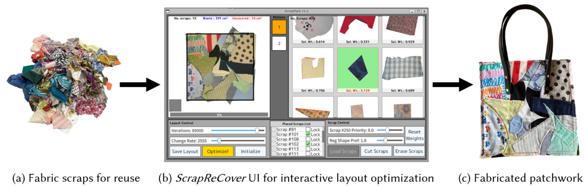
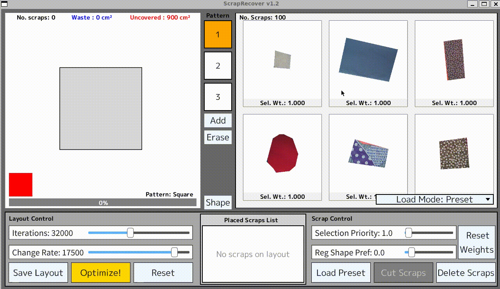

# ScrapReCover: An Interactive Optimization System for Freeform Patchwork Layouts

[](https://dl.acm.org/doi/10.1145/3745778.3766653)
[](https://www.wiss.org/WISS2025Proceedings/data/demo/3-A01.pdf)
[](https://opensource.org/licenses/MIT)

[](https://marc2825.github.io/ScrapReCover) **<- CLICK !**





**ScrapReCover** is an interactive tool for designing freeform patchwork layouts from fabric scraps.

The system enables users to iteratively refine the layout by combining manual adjustments of individual scraps with automatic placement suggestions guided by user-controlled parameters. These parameters can be intuitively adjusted to control the degree of modification from the current layout and to prioritize specific types of scraps. For automatic suggestions, the system generates layouts by arranging arbitrarily shaped scraps within the target area, using an optimization strategy that minimizes material waste while ensuring complete coverage. To achieve this functionality, ScrapReCover employs simulated annealing (SA), a robust metaheuristic and stochastic algorithm known for its effectiveness in packing-like problems, integrated with a rasterized representation of both scraps and pattern shapes.


## Quick Start (WSL2)
This project depends on C++ and [Siv3D Framework](https://github.com/Siv3D/OpenSiv3D) and links against the copy under `external/Siv3D`.
The executable is emitted to `external/Siv3D/Linux/App/Siv3DApp` and should be run from that directory.
(References: [Build guide for Siv3D](https://siv3d.github.io/ja-jp/download/ubuntu/))

### Build (Ubuntu 20.04/22.04 LTS on WSL2)
1) Install build dependencies:
```bash
sudo apt update
sudo apt install -y build-essential cmake git ninja-build \
  libasound2-dev libavcodec-dev libavformat-dev libavutil-dev libboost-dev \
  libcurl4-openssl-dev libgtk-3-dev libgif-dev libglu1-mesa-dev libharfbuzz-dev \
  libmpg123-dev libopencv-dev libopus-dev libopusfile-dev libsoundtouch-dev \
  libswresample-dev libtiff-dev libturbojpeg0-dev libvorbis-dev libwebp-dev \
  libxft-dev uuid-dev xorg-dev
```

2) Initialize submodules (Siv3D + json):
```bash
git submodule update --init --recursive
```

3) Build and install Siv3D:
```bash
cd external/Siv3D/Linux
mkdir -p build && cd build
cmake -GNinja -DCMAKE_BUILD_TYPE=RelWithDebInfo ..
cd ..
cmake --build build
sudo cmake --install build
```

4) Build ScrapReCover:
```bash
cd ../../..
rm -rf build && mkdir build && cd build
cmake -GNinja -DCMAKE_BUILD_TYPE=RelWithDebInfo ..
cmake --build . -j1
```

5) Install Python deps for the scrap measurement tool (`src/ui/measure_scrap`):
```bash
sudo apt update
sudo apt install -y python3.10 python3-pip python3-tk
python3 -m pip install --user -r ../requirements.txt
```

### Run ScrapReCover
```bash
../external/Siv3D/Linux/App/Siv3DApp
```
